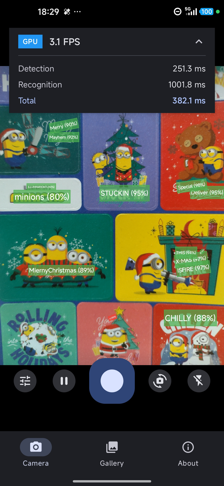
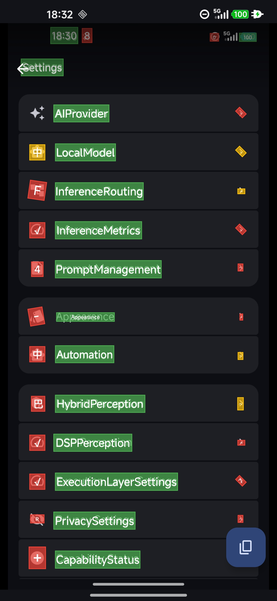
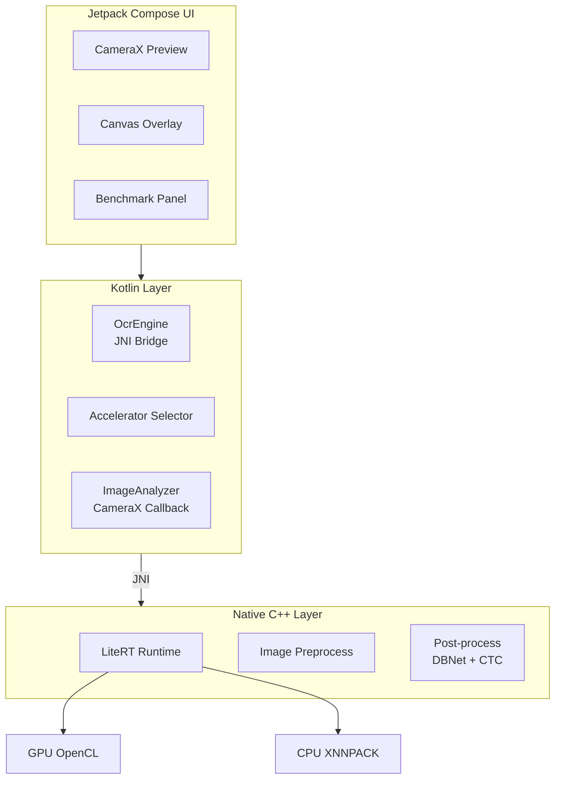
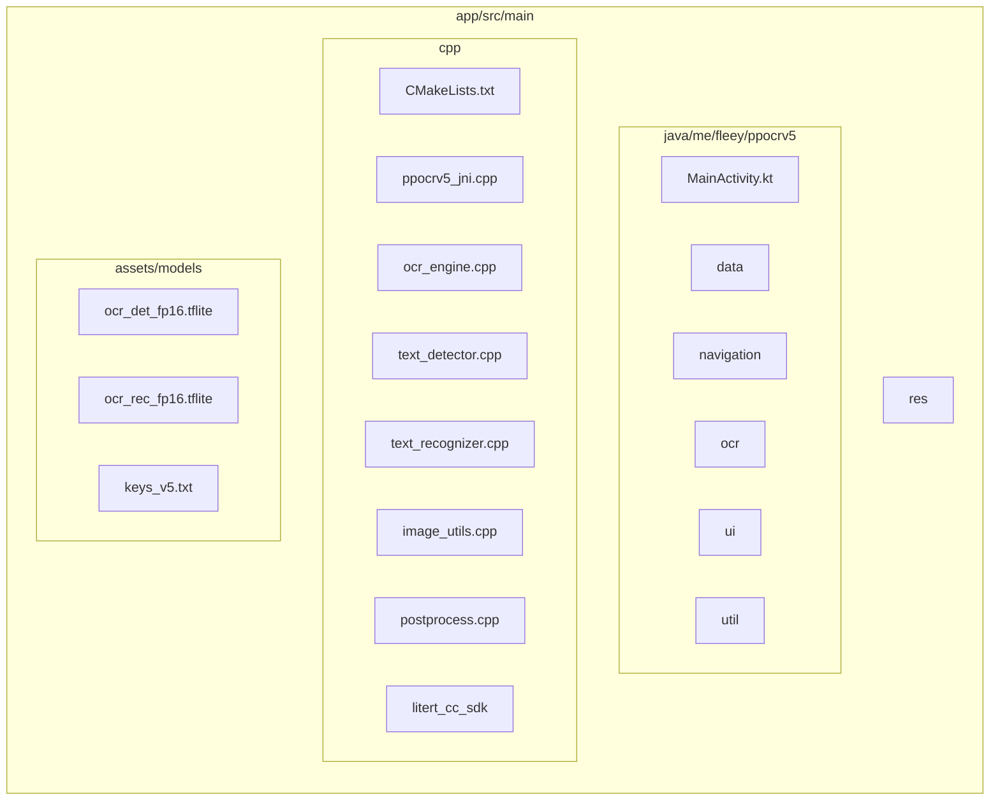
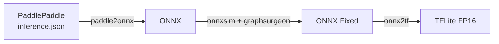

# PPOCRv5-Android

[English](README.md) | [中文](README_zh.md)

High-performance on-device OCR application for Android using LiteRT (formerly TensorFlow Lite). This project demonstrates real-time text detection and recognition using PP-OCRv5 models from PaddleOCR, optimized for mobile deployment.

> This project originated as a byproduct while building a larger on-device AI project (also coming soon as open source). I polished it up and decided to share it with the community.

## Screenshots

| Camera OCR                         | Gallery OCR                         |
|------------------------------------|-------------------------------------|
|  |  |

## Features

- Real-time camera OCR with live text detection overlay
- Gallery image OCR with interactive text selection
- GPU-accelerated inference via OpenCL
- FP16 quantized models for optimal performance/accuracy balance
- Pure C++ image preprocessing (no OpenCV dependency)
- Support for 18,383 characters (CJK, Latin, symbols...)
- Rotated text detection with arbitrary angle support

## Architecture



## Requirements

| Component   | Version             |
|-------------|---------------------|
| Android SDK | 28+ (Android 9.0)   |
| NDK         | 29.0.14206865       |
| CMake       | 3.22.1              |
| Gradle      | 9.2.1               |
| AGP         | 8.13.2              |
| Kotlin      | 2.3.0 (K2 compiler) |
| Java        | 21                  |

## Build

```bash
# Debug build
./gradlew assembleDebug

# Release build (minified, optimized)
./gradlew assembleRelease

# Run unit tests
./gradlew test

# Run instrumented tests
./gradlew connectedAndroidTest

# Clean build artifacts
./gradlew clean
```

The release APK is located at `app/build/outputs/apk/release/app-release.apk`.

## Project Structure



## Models

| Model                 | Architecture | Input Shape        | Quantization |
|-----------------------|--------------|--------------------|--------------|
| ocr_det_fp16.tflite   | DBNet        | [1, 640, 640, 3]   | FP16         |
| ocr_rec_fp16.tflite   | SVTRv2       | [1, 48, W, 3]      | FP16         |
| keys_v5.txt           | Dictionary   | -                  | -            |

Models are sourced from [PaddleOCR](https://github.com/PaddlePaddle/PaddleOCR) and converted to TFLite format with FP16 quantization.

## Model Conversion

The project includes a GitHub Actions workflow for automated model conversion. You can also run the conversion manually.

### Conversion Pipeline



### Automated Conversion (GitHub Actions)

The workflow triggers automatically when `app/src/main/assets/models/manifest.json` is modified, or can be triggered manually via `workflow_dispatch`.

Converted models are uploaded as artifacts with 90-day retention.

### Manual Conversion

#### Prerequisites

```bash
pip install paddlepaddle paddle2onnx onnxsim huggingface_hub numpy psutil
pip install onnx==1.15.0 onnx_graphsurgeon
pip install tensorflow==2.15.0 tf_keras
pip install sng4onnx onnx2tf==1.22.3
```

#### Step 1: Download PP-OCRv5 Models

```python
from huggingface_hub import snapshot_download

snapshot_download(repo_id="PaddlePaddle/PP-OCRv5_mobile_det", local_dir="models_tmp/det")
snapshot_download(repo_id="PaddlePaddle/PP-OCRv5_mobile_rec", local_dir="models_tmp/rec")
```

#### Step 2: Convert to ONNX

```bash
paddle2onnx --model_dir models_tmp/det \
  --model_filename inference.json \
  --params_filename inference.pdiparams \
  --save_file models_tmp/ocr_det_v5.onnx \
  --opset_version 14

paddle2onnx --model_dir models_tmp/rec \
  --model_filename inference.json \
  --params_filename inference.pdiparams \
  --save_file models_tmp/ocr_rec_v5.onnx \
  --opset_version 14
```

#### Step 3: Fix ONNX for GPU Compatibility

The ONNX models require modifications for LiteRT GPU delegate compatibility:

1. Simplify with static input shapes using `onnxsim`
2. Decompose `HardSigmoid` into primitive ops (Mul, Add, Max, Min)
3. Change `Resize` coordinate_transformation_mode from `half_pixel` to `asymmetric`

See `.github/workflows/convert-models.yml` for the complete fix script.

#### Step 4: Convert to TFLite FP16

```bash
# Detection model
onnx2tf -i models_tmp/ocr_det_v5_fixed.onnx -o models_tmp/converted_det \
  -b 1 -ois x:1,3,640,640 -n

# Recognition model
onnx2tf -i models_tmp/ocr_rec_v5_fixed.onnx -o models_tmp/converted_rec \
  -b 1 -ois x:1,3,48,320 -n
```

The FP16 TFLite files are generated in the output directories.

#### Step 5: Download Dictionary

```bash
wget https://raw.githubusercontent.com/PaddlePaddle/PaddleOCR/main/ppocr/utils/dict/ppocrv5_dict.txt \
  -O app/src/main/assets/models/keys_v5.txt
```

### GPU Compatibility Notes

The conversion process ensures compatibility with LiteRT GPU delegate:

- Static input shapes (required for GPU acceleration)
- No unsupported operators (HardSigmoid decomposed)
- Asymmetric resize mode (better GPU support)
- FP16 quantization (optimal for mobile GPU)

## OCR Pipeline

### Detection (DBNet)

1. Resize input image to 640x640 with aspect ratio preservation
2. Normalize with ImageNet statistics:
   - Mean: [0.485, 0.456, 0.406]
   - Std: [0.229, 0.224, 0.225]
3. Run inference to produce probability map
4. Threshold binarization (threshold: 0.3)
5. Contour detection and minimum area rectangle extraction
6. Filter boxes by confidence (>0.5) and area

### Recognition (SVTRv2)

1. Crop and rotate text region from original image
2. Resize to height 48, variable width (max 320)
3. Normalize:
   - Mean: [0.5, 0.5, 0.5]
   - Std: [0.5, 0.5, 0.5]
4. Run inference to produce character logits
5. CTC greedy decoding with dictionary lookup
6. Output recognized text with confidence score

## Hardware Acceleration

The application uses LiteRT with GPU acceleration via OpenCL. The accelerator selection follows this priority:

| Priority | Accelerator | Backend    | Notes                              |
|----------|-------------|------------|------------------------------------|
| 1        | GPU         | OpenCL     | Recommended for FP16 models        |
| 2        | CPU         | XNNPACK    | Universal fallback                 |

GPU acceleration is enabled by default and provides 2-4x speedup over CPU on most devices. The application automatically falls back to CPU if GPU initialization fails.

## Native Layer

The native layer is implemented in C++17 using the LiteRT C++ API. Key components:

- `OcrEngine`: Orchestrates detection and recognition pipeline
- `TextDetector`: DBNet inference with post-processing
- `TextRecognizer`: SVTRv2 inference with CTC decoding
- `ImageUtils`: Resize, normalize, crop operations (NEON-optimized)
- `Postprocess`: Contour detection, rotated rectangle extraction

Build optimizations for release:
- LTO (Link-Time Optimization)
- NEON SIMD vectorization
- Function/data section garbage collection
- Symbol visibility hiding

## Permissions

| Permission                | Purpose                    | Required |
|---------------------------|----------------------------|----------|
| android.permission.CAMERA | Camera preview and capture | Yes      |

## Supported ABIs

Only `arm64-v8a` is supported. 32-bit architectures are excluded to reduce APK size and because GPU delegates require 64-bit.

## License

```
Copyright 2025 Fleey

Licensed under the Apache License, Version 2.0 (the "License");
you may not use this file except in compliance with the License.
You may obtain a copy of the License at

    http://www.apache.org/licenses/LICENSE-2.0

Unless required by applicable law or agreed to in writing, software
distributed under the License is distributed on an "AS IS" BASIS,
WITHOUT WARRANTIES OR CONDITIONS OF ANY KIND, either express or implied.
See the License for the specific language governing permissions and
limitations under the License.
```

## Acknowledgments

- [PaddleOCR](https://github.com/PaddlePaddle/PaddleOCR) - PP-OCRv5 models
- [LiteRT](https://ai.google.dev/edge/litert) - On-device ML runtime
- [Abseil](https://abseil.io/) - C++ common libraries
