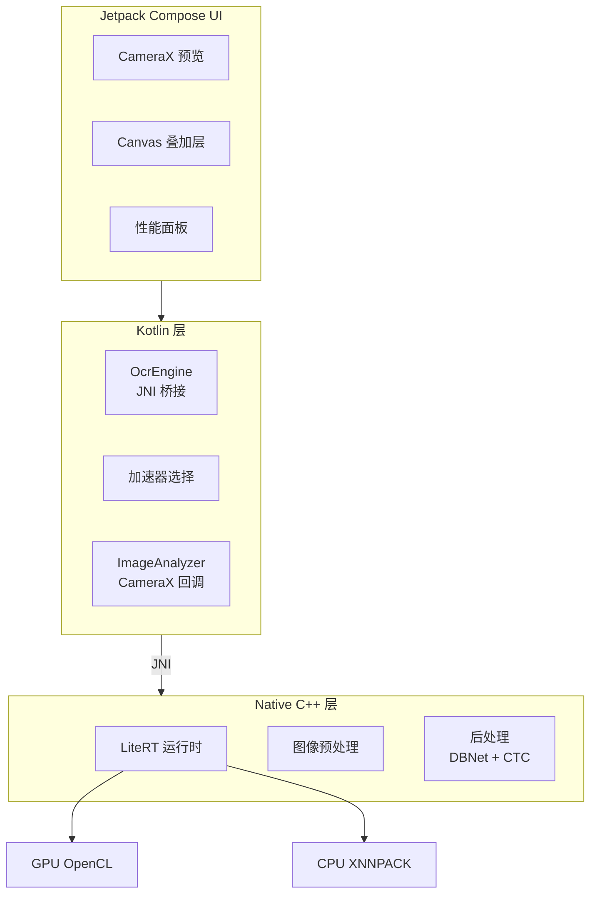
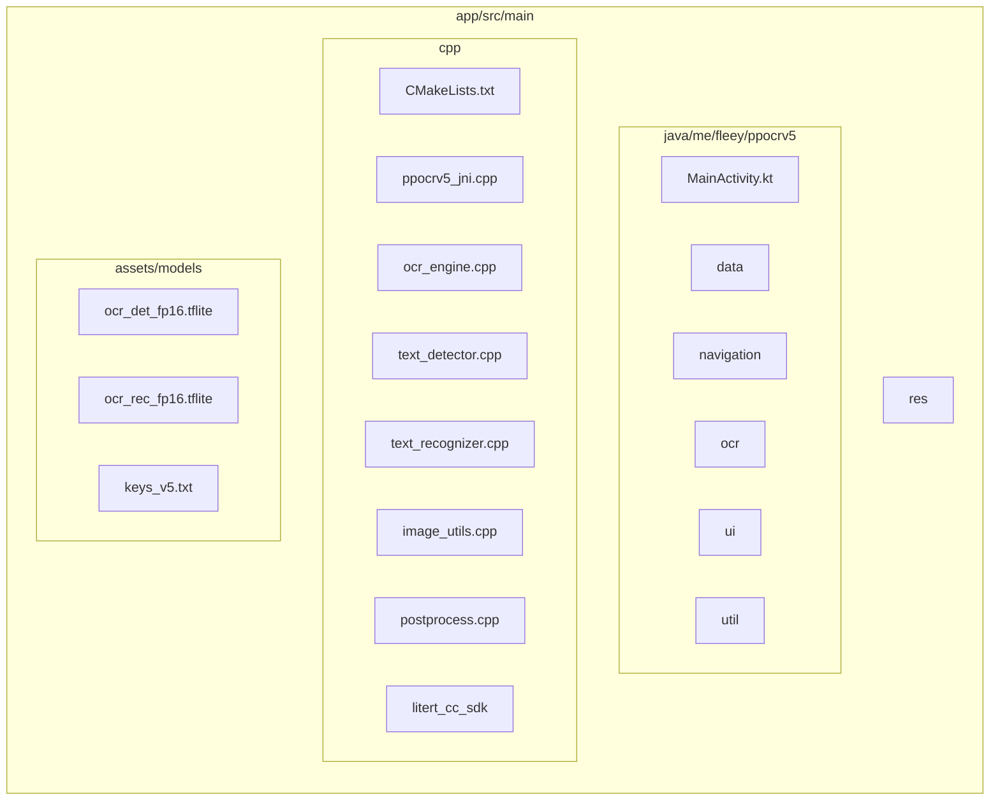
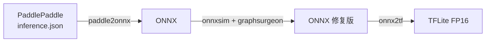

# PPOCRv5-Android

[English](README.md) | [中文](README_zh.md)

基于 LiteRT（原 TensorFlow Lite）的高性能端侧 OCR 应用。本项目使用 PaddleOCR 的 PP-OCRv5 模型实现实时文字检测与识别，针对移动端部署进行了优化。

> 这个项目是我在构建另一个更大的端侧 AI 项目时的副产物（该项目也将开源，敬请期待）。整理优化后决定先行开源分享给大家。

## 截图

| 相机 OCR                         | 相册 OCR                         |
|--------------------------------|--------------------------------|
|  |  |

## 功能特性

- 实时相机 OCR，支持文字检测框叠加显示
- 相册图片 OCR，支持交互式文字选择
- 基于 OpenCL 的 GPU 加速推理
- FP16 量化模型，兼顾性能与精度
- 纯 C++ 图像预处理（无 OpenCV 依赖）
- 支持 18,383 个字符（中日韩、拉丁、符号等）
- 支持任意角度的旋转文字检测

## 架构



## 环境要求

| 组件        | 版本                |
|-------------|---------------------|
| Android SDK | 28+（Android 9.0）  |
| NDK         | 29.0.14206865       |
| CMake       | 3.22.1              |
| Gradle      | 9.2.1               |
| AGP         | 8.13.2              |
| Kotlin      | 2.3.0（K2 编译器）  |
| Java        | 21                  |

## 构建

```bash
# Debug 构建
./gradlew assembleDebug

# Release 构建（混淆、优化）
./gradlew assembleRelease

# 运行单元测试
./gradlew test

# 运行设备测试
./gradlew connectedAndroidTest

# 清理构建产物
./gradlew clean
```

Release APK 位于 `app/build/outputs/apk/release/app-release.apk`。

## 项目结构



## 模型

| 模型                  | 架构     | 输入形状           | 量化方式 |
|-----------------------|----------|--------------------|----------|
| ocr_det_fp16.tflite   | DBNet    | [1, 640, 640, 3]   | FP16     |
| ocr_rec_fp16.tflite   | SVTRv2   | [1, 48, W, 3]      | FP16     |
| keys_v5.txt           | 字典     | -                  | -        |

模型来源于 [PaddleOCR](https://github.com/PaddlePaddle/PaddleOCR)，已转换为 TFLite 格式并进行 FP16 量化。

## 模型转换

项目包含 GitHub Actions 工作流用于自动模型转换，也可手动执行转换。

### 转换流程



### 自动转换（GitHub Actions）

当 `app/src/main/assets/models/manifest.json` 被修改时自动触发工作流，也可通过 `workflow_dispatch` 手动触发。

转换后的模型作为 Artifacts 上传，保留 90 天。

### 手动转换

#### 前置依赖

```bash
pip install paddlepaddle paddle2onnx onnxsim huggingface_hub numpy psutil
pip install onnx==1.15.0 onnx_graphsurgeon
pip install tensorflow==2.15.0 tf_keras
pip install sng4onnx onnx2tf==1.22.3
```

#### 步骤 1: 下载 PP-OCRv5 模型

```python
from huggingface_hub import snapshot_download

snapshot_download(repo_id="PaddlePaddle/PP-OCRv5_mobile_det", local_dir="models_tmp/det")
snapshot_download(repo_id="PaddlePaddle/PP-OCRv5_mobile_rec", local_dir="models_tmp/rec")
```

#### 步骤 2: 转换为 ONNX

```bash
paddle2onnx --model_dir models_tmp/det \
  --model_filename inference.json \
  --params_filename inference.pdiparams \
  --save_file models_tmp/ocr_det_v5.onnx \
  --opset_version 14

paddle2onnx --model_dir models_tmp/rec \
  --model_filename inference.json \
  --params_filename inference.pdiparams \
  --save_file models_tmp/ocr_rec_v5.onnx \
  --opset_version 14
```

#### 步骤 3: 修复 ONNX 以兼容 GPU

ONNX 模型需要修改以兼容 LiteRT GPU delegate:

1. 使用 `onnxsim` 简化并固定输入形状
2. 将 `HardSigmoid` 分解为基础算子（Mul, Add, Max, Min）
3. 将 `Resize` 的 coordinate_transformation_mode 从 `half_pixel` 改为 `asymmetric`

完整修复脚本见 `.github/workflows/convert-models.yml`。

#### 步骤 4: 转换为 TFLite FP16

```bash
# 检测模型
onnx2tf -i models_tmp/ocr_det_v5_fixed.onnx -o models_tmp/converted_det \
  -b 1 -ois x:1,3,640,640 -n

# 识别模型
onnx2tf -i models_tmp/ocr_rec_v5_fixed.onnx -o models_tmp/converted_rec \
  -b 1 -ois x:1,3,48,320 -n
```

FP16 TFLite 文件生成在输出目录中。

#### 步骤 5: 下载字典

```bash
wget https://raw.githubusercontent.com/PaddlePaddle/PaddleOCR/main/ppocr/utils/dict/ppocrv5_dict.txt \
  -O app/src/main/assets/models/keys_v5.txt
```

### GPU 兼容性说明

转换过程确保与 LiteRT GPU delegate 兼容:

- 静态输入形状（GPU 加速必需）
- 无不支持的算子（HardSigmoid 已分解）
- 非对称 resize 模式（更好的 GPU 支持）
- FP16 量化（移动端 GPU 最优）

## OCR 流程

### 检测（DBNet）

1. 将输入图像缩放至 640x640，保持宽高比
2. 使用 ImageNet 统计值归一化:
   - Mean: [0.485, 0.456, 0.406]
   - Std: [0.229, 0.224, 0.225]
3. 推理生成概率图
4. 阈值二值化（阈值: 0.3）
5. 轮廓检测与最小外接矩形提取
6. 按置信度（>0.5）和面积过滤检测框

### 识别（SVTRv2）

1. 从原图裁剪并旋转文字区域
2. 缩放至高度 48，宽度可变（最大 320）
3. 归一化:
   - Mean: [0.5, 0.5, 0.5]
   - Std: [0.5, 0.5, 0.5]
4. 推理生成字符 logits
5. CTC 贪婪解码与字典查找
6. 输出识别文本及置信度

## 硬件加速

应用使用 LiteRT 通过 OpenCL 进行 GPU 加速。加速器选择优先级:

| 优先级 | 加速器 | 后端    | 说明                    |
|--------|--------|---------|-------------------------|
| 1      | GPU    | OpenCL  | FP16 模型推荐           |
| 2      | CPU    | XNNPACK | 通用回退                |

默认启用 GPU 加速，在大多数设备上可获得 2-4 倍的 CPU 加速比。若 GPU 初始化失败，应用自动回退至 CPU。

## Native 层

Native 层使用 C++17 和 LiteRT C++ API 实现。核心组件:

- `OcrEngine`: 协调检测与识别流程
- `TextDetector`: DBNet 推理与后处理
- `TextRecognizer`: SVTRv2 推理与 CTC 解码
- `ImageUtils`: 缩放、归一化、裁剪操作（NEON 优化）
- `Postprocess`: 轮廓检测、旋转矩形提取

Release 构建优化:
- LTO（链接时优化)
- NEON SIMD 向量化
- 函数/数据段垃圾回收
- 符号可见性隐藏

## 权限

| 权限                      | 用途             | 必需 |
|---------------------------|------------------|------|
| android.permission.CAMERA | 相机预览与拍摄   | 是   |

## 支持的 ABI

仅支持 `arm64-v8a`。排除 32 位架构以减小 APK 体积，且 GPU delegate 需要 64 位支持。

## 许可证

```
Copyright 2025 Fleey

Licensed under the Apache License, Version 2.0 (the "License");
you may not use this file except in compliance with the License.
You may obtain a copy of the License at

    http://www.apache.org/licenses/LICENSE-2.0

Unless required by applicable law or agreed to in writing, software
distributed under the License is distributed on an "AS IS" BASIS,
WITHOUT WARRANTIES OR CONDITIONS OF ANY KIND, either express or implied.
See the License for the specific language governing permissions and
limitations under the License.
```

## 致谢

- [PaddleOCR](https://github.com/PaddlePaddle/PaddleOCR) - PP-OCRv5 模型
- [LiteRT](https://ai.google.dev/edge/litert) - 端侧 ML 运行时
- [Abseil](https://abseil.io/) - C++ 通用库
